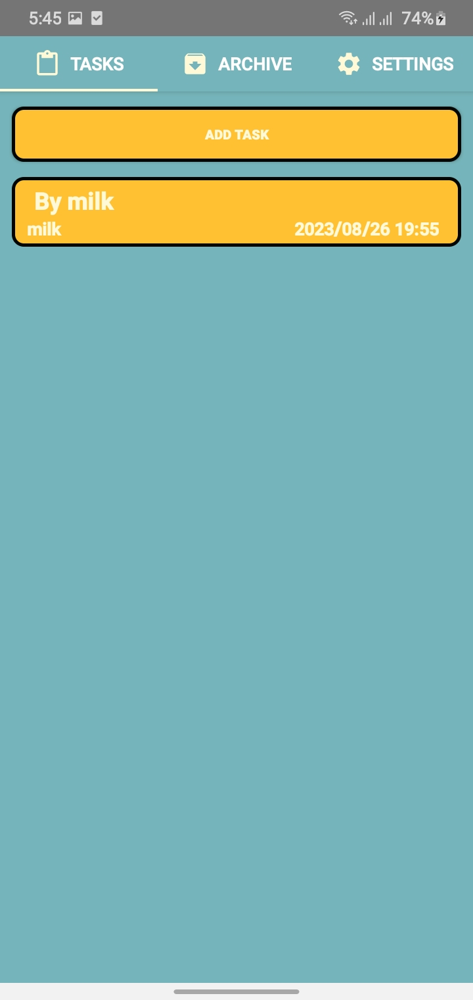
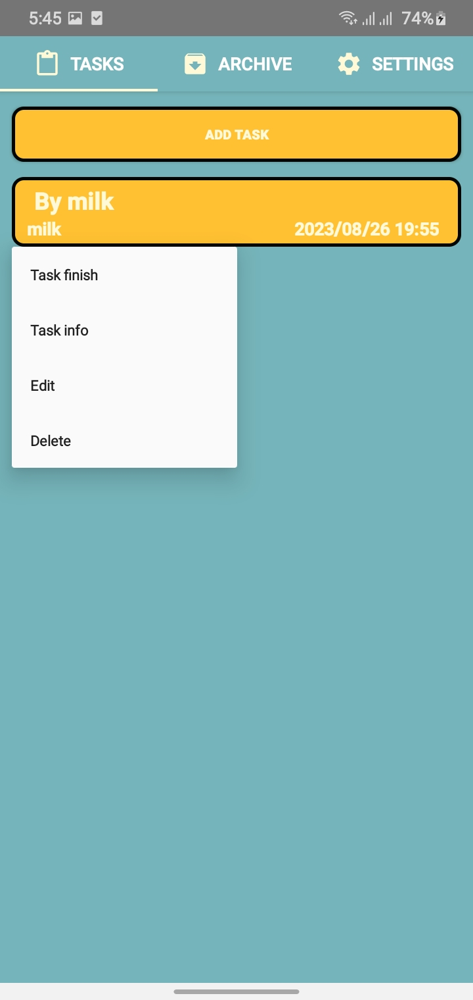
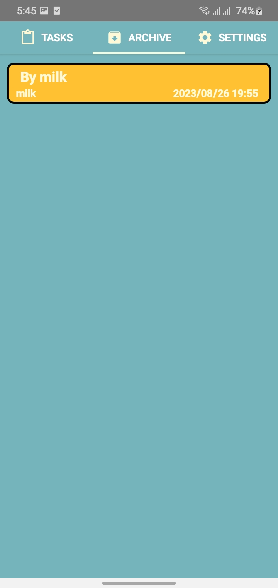

# RemindMe
The application allows users to categorize or group tasks by project, importance, date, or any other custom criteria. This helps users to maintain a clear overview of their responsibilities.
 

